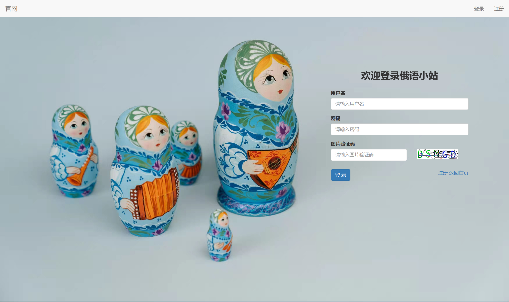
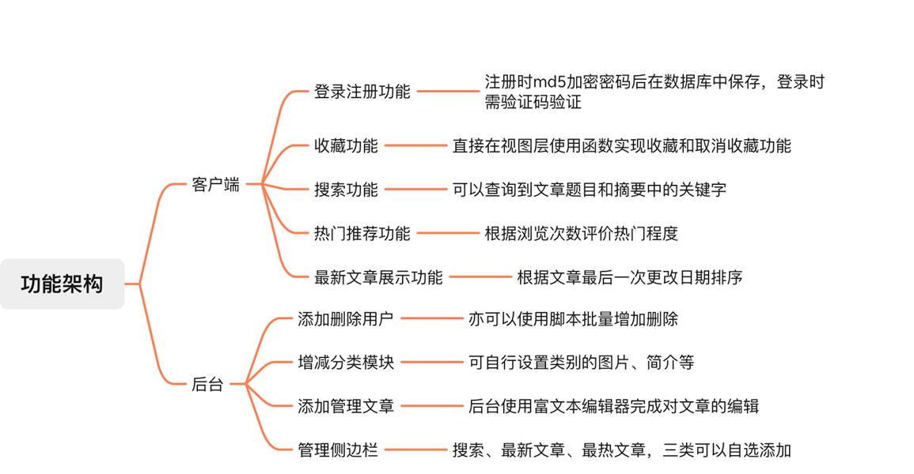

# 一个基于Django+Mysql的资讯平台
## 简介
这是一个简单的资讯平台，最初设计时制作了一个俄语学习网站练手。网页截图和安装方法附上~

### 登录注册
（http://127.0.0.1:8000/）


### 首页


### 官网
（http://127.0.0.1:8000/web/）


### 后台 
（http://127.0.0.1:8000/admin/）


### 整体功能架构



## 安装方法

- 新建并且激活环境

```bash
python -m venv venv 
.\venv\Scripts\Activate.ps1  
```

- 下载依赖

```bash
pip install -r requirement.txt
```

- 修改数据库配置文件`djangoProject1\settings.py`

（在此之前需要在mysql中新建一个database哦）

```
DATABASES = {
    'default': {
        'ENGINE': 'django.db.backends.mysql',
        'NAME': 'russta',#修改成自己的数据库名称
        'USER': 'root',
        'PASSWORD': 'yourpassword',#修改成自己的密码
        'HOST': '127.0.0.1',
        'PORT': 3306,
    }
}
```

- 数据库迁移

```bash
python manage.py makemigrations  
python manage.py migrate
```

- 运行

```
python manage.py runserver
```


